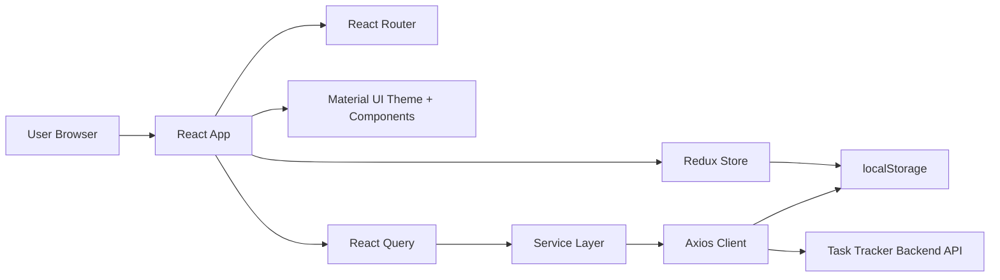
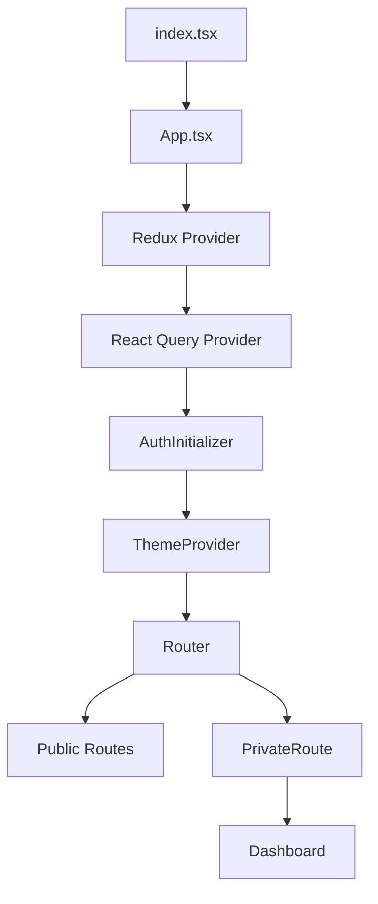
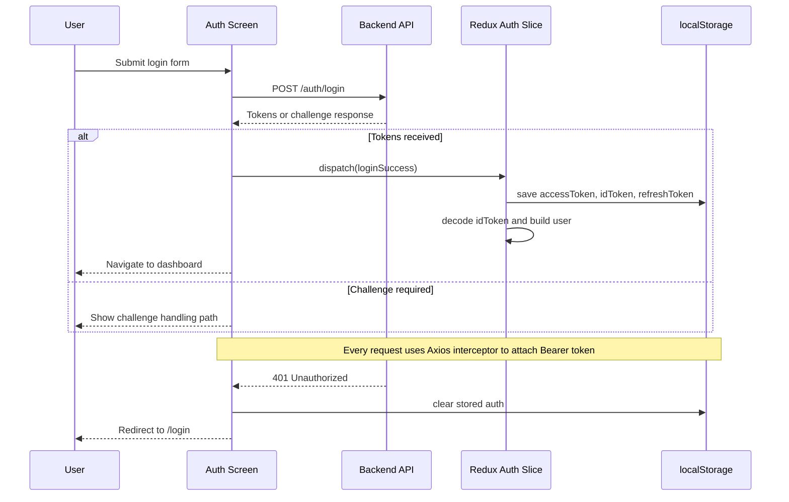

# Task Tracker Frontend

Task Tracker Frontend is a React + TypeScript application for authenticated task, project, and user administration workflows. It is the UI layer for the Task Tracker backend API and currently uses Material UI for the interface, Redux Toolkit for client-side app state, and TanStack React Query for server-state fetching and cache management.

## Overview

This frontend provides:

- Authentication flows for login, registration, confirmation, and password reset
- Protected dashboard navigation after authentication
- Project CRUD flows
- Task CRUD flows with filters and task detail dialog support
- User profile view
- Admin-only user management with role updates and delete actions
- Global notifications and light/dark theming

The current codebase has already moved beyond the earlier JavaScript/CSS-heavy structure. It is now organized around feature folders, typed service modules, typed hooks, and shared state slices.

## Latest Updates

- Migrated the frontend from JavaScript to TypeScript (`.tsx` + shared types).
- Reworked the UI using Material UI components and a responsive dashboard shell.
- Added Redux Toolkit for auth state, notifications, and theme management.
- Added TanStack React Query for API reads, mutations, and cache invalidation.
- Added a themed dashboard overview with navigation cards and summary statistics.
- Added task filtering by status, project, and assigned user.
- Added forgot-password flow.
- Added support for auth challenge handling, including new-password challenge responses.
- Added admin user management with role update and delete-user integration.
- Added app branding via reusable logo component and tab icon updates.
- Moved API base URL handling to environment variables.

## Tech Stack

- React 19
- TypeScript
- Material UI 5
- React Router DOM 7
- Redux Toolkit
- React Redux
- TanStack React Query
- Axios
- JWT Decode
- Create React App

## Architecture

### High-Level Architecture



### App Bootstrap Flow



### Authentication Lifecycle



### Dashboard Route Map

```mermaid
flowchart TD
    ROOT[/] --> DASH[/dashboard]
    ROOT --> LOGIN[/login]
    ROOT --> REGISTER[/register]
    ROOT --> CONFIRM[/confirm]
    ROOT --> FORGOT[/forgot-password]

    DASH --> OVERVIEW[Overview]
    DASH --> PROJECTS[Projects]
    DASH --> MYTASKS[My Tasks]
    DASH --> ALLTASKS[All Tasks]
    DASH --> PROFILE[Profile]
    DASH --> USERS[User Management - Admin only]
```

## Current Features

### Authentication

- Login with backend-issued JWT tokens
- Registration flow
- Email confirmation flow
- Forgot-password request and reset confirmation flow
- Auth restoration on page reload from saved tokens
- Role extraction from decoded ID token
- Challenge-aware login handling for backend auth flows
- Automatic redirect to login on `401 Unauthorized`

### Dashboard Experience

- Responsive sidebar navigation
- Mobile drawer support
- Overview page with statistics cards
- Quick drill-down from overview cards into filtered task views
- Theme toggle between light and dark modes
- Global snackbar-style notifications
- Profile menu with logout support

### Projects

- Fetch and display project list
- Create project
- Edit project
- Delete project
- View tasks for a selected project

### Tasks

- View all tasks
- View only tasks assigned to the current user
- Create task
- Edit task
- Delete task
- Filter by:
  - Status
  - Project
  - Assigned user
- Open a shared task detail dialog
- Navigate from dashboard summary cards using query-string status filters

### User Management

- View registered users
- Update a user's role
- Delete a user
- Restrict access to admin users only

## State Management Model

The frontend intentionally separates client state from server state.

### Redux Toolkit is used for:

- Authentication state
- Current authenticated user
- Theme selection
- Notification state

### React Query is used for:

- Fetching projects, tasks, and users
- Handling create/update/delete mutations
- Cache invalidation after mutations
- Query-key-based data separation

### Why this split exists

- Redux handles durable UI/application state.
- React Query handles API-backed state and reduces manual loading/cache boilerplate.

## Auth and Token Handling

The application stores auth tokens in `localStorage`:

- `accessToken`
- `idToken`
- `refreshToken`

Key implementation details:

- The user is reconstructed from the `idToken`, not the `accessToken`.
- The auth slice decodes the ID token using `jwt-decode`.
- Username is read from `cognito:username` or `username`.
- Roles are read from `cognito:groups` or `groups`.
- If the token is expired or invalid, auth storage is cleared.
- Axios attaches the access token to outgoing requests.
- Axios clears auth and redirects to `/login` on `401`.

## Permissions and Role Awareness

The UI uses permission helpers in `src/utils/permissions.ts` to control what users can do.

Current role-aware behavior includes:

- Admin-only user management route
- Conditional project create/update/delete actions
- Conditional task create/update/delete actions
- Protected route access through `PrivateRoute`

The exact roles returned by the backend are surfaced in the UI and used for permission checks.

## Folder Structure

```text
src/
|-- components/
|   |-- common/
|   |   |-- AuthDebugger.tsx
|   |   |-- Logo.tsx
|   |   |-- Notification.tsx
|   |   `-- TaskDetailDialog.tsx
|   `-- PrivateRoute.tsx
|-- features/
|   |-- auth/
|   |   |-- ConfirmRegistration.tsx
|   |   |-- ForgotPassword.tsx
|   |   |-- Login.tsx
|   |   `-- Register.tsx
|   `-- dashboard/
|       |-- Dashboard.tsx
|       |-- OverviewView.tsx
|       |-- ProjectsView.tsx
|       |-- TasksView.tsx
|       |-- UserManagementView.tsx
|       `-- UserProfileView.tsx
|-- hooks/
|   |-- useAuth.ts
|   |-- useProjects.ts
|   |-- useTasks.ts
|   `-- useUsers.ts
|-- services/
|   |-- apiClient.ts
|   |-- authService.ts
|   |-- projectService.ts
|   |-- taskService.ts
|   `-- userService.ts
|-- store/
|   |-- authSlice.ts
|   |-- index.ts
|   `-- uiSlice.ts
|-- styles/
|   `-- theme.ts
|-- types/
|   `-- index.ts
|-- utils/
|   `-- permissions.ts
|-- App.tsx
|-- index.tsx
`-- index.css
```

## Data Flow

### Read flow

1. A screen calls a React Query hook such as `useProjects`, `useTasks`, or `useUsers`.
2. The hook calls a typed service method.
3. The service uses the shared Axios client.
4. The Axios client injects auth headers.
5. The backend responds with typed data.
6. React Query caches the response and the UI re-renders.

### Mutation flow

1. A form submits create/update/delete input.
2. A mutation hook calls the relevant service method.
3. On success, React Query invalidates affected query keys.
4. Redux triggers a success or error notification.
5. The latest server state is re-fetched and displayed.

## Environment Configuration

Copy `.env.example` to `.env` and set the API base URL:

```env
REACT_APP_API_BASE_URL=http://localhost:8080/api
```

Fallback behavior:

- If `REACT_APP_API_BASE_URL` is not set, the app defaults to `http://localhost:8080/api`.

## Prerequisites

- Node.js 18+ recommended
- npm
- A running backend API reachable from the frontend

## Getting Started

### 1. Install dependencies

```bash
npm install
```

### 2. Configure environment

```env
REACT_APP_API_BASE_URL=http://localhost:8080/api
```

### 3. Start the app

```bash
npm start
```

### 4. Open the frontend

```text
http://localhost:3000
```

## Available Scripts

### `npm start`

Runs the app in development mode.

### `npm test`

Runs the test suite in watch mode.

### `npm run build`

Creates the production build in the `build/` directory.

### `npm run eject`

Ejects the Create React App configuration. This is a one-way operation.

## Backend API Expectations

The frontend expects backend endpoints under the configured base URL. Based on the current service layer, the UI depends on endpoints such as:

### Auth endpoints

- `POST /auth/login`
- `POST /auth/register`
- `POST /auth/confirm`
- `POST /auth/new-password`
- `POST /auth/forgot-password`
- `POST /auth/confirm-forgot-password`
- `POST /auth/refresh`
- `POST /auth/assign-role`

### User endpoints

- `GET /users`
- `GET /users/username/{username}`
- `DELETE /users/{id}`

### Project endpoints

- Project list/read/write endpoints under `/projects`

### Task endpoints

- Task list/read/write endpoints under `/tasks`

The project and task service modules assume a conventional CRUD backend and are wired through the shared Axios client.

## Routing Summary

### Public routes

- `/login`
- `/register`
- `/confirm`
- `/forgot-password`

### Protected routes

- `/dashboard`
- `/dashboard/projects`
- `/dashboard/projects/:projectId/tasks`
- `/dashboard/tasks`
- `/dashboard/all-tasks`
- `/dashboard/profile`
- `/dashboard/users` for admins

## UI Notes

- The app uses Material UI cards, dialogs, tables, chips, menus, drawers, and form controls.
- The dashboard is designed to work on both desktop and mobile layouts.
- Notifications are centralized in a shared component.
- Theme selection is stored in Redux and applied at the app shell level.

## TypeScript Notes

The codebase uses strict TypeScript settings, including:

- `strict`
- `noUnusedLocals`
- `noUnusedParameters`
- `noImplicitReturns`
- `noFallthroughCasesInSwitch`

Path aliases are configured in `tsconfig.json`, including:

- `@/*`
- `@components/*`
- `@features/*`
- `@services/*`
- `@hooks/*`
- `@store/*`
- `@types/*`
- `@utils/*`
- `@styles/*`

## Testing and Build

- Test runner: React Scripts / Testing Library setup
- Production build: `npm run build`
- Entry test file currently exists at `src/App.test.tsx`

## Known Implementation Notes

- Auth state is restored from `localStorage` during app initialization.
- Unauthorized API responses currently trigger a full redirect to `/login`.
- User deletion in the current frontend flow first resolves a user by username and then calls delete by numeric ID.
- The app includes an `AuthDebugger` component in the app shell, which is useful during development but may not be intended for production use.

## Summary

The frontend is now a typed, feature-structured React application with a modern dashboard UI, server-state management via React Query, app-state handling via Redux Toolkit, and a service-driven API integration layer. The README now reflects the implemented state of the project rather than the older planned-state structure.
